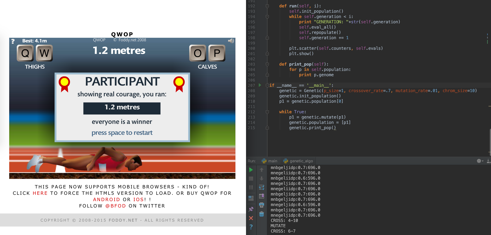

# my honors thesis on QWOP

`genetic_algo.py` contains the code for a cellular genetic algorithm that currently uses 2 point crossover to preserve chromosome length.

`main.py` contains the code to run everything. you can sepcify how many generations to run. this is the file you want to run.

`image_recognizer.py` contains the code that is used by `game_detector.py` to read numbers

`game_detector.py` contains the code that is used to get the score and game state (end) and where the game is located on the screen. ~~currently working on dynamic prediction of where the game box is~~

### am also working on other ways to encode the genomes

currently it is encoded as a sequence of letters from a-p where 'a' is holding all 4 buttons down to where 'p' is not holding any buttons down. there is a total of 16 combinations.

### example running

 
